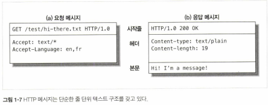

# 01장. HTTP 개관


## 1.1 HTTP : 인터넷의 멀티미디어 배달부

- HTTP는 신뢰성 있는 데이터 전송 프로토콜을 사용하기 때문에, 전송 중 손상되거나 꼬이지 않음을 보장한다.


## 1.2 웹 클라이언트 서버

- 웹 서버는 인터넷의 데이터를 저장하고, HTTP 클라이언트가 요청한 데이터를 제공한다.


## 1.3 리소스

- 콘텐츠의 원천


#### 1.3.1 미디어 타입

- HTTP는 웹에서 전송되는 객체 각각에 MIME 타입이라는 데이터 포맷 라벨을 붙인다.
- MIME를 통해 서버로부터 객체를 돌려받을 때, 다룰 수 있는 객체인지 확인한다.
- /로 구분된 두 개의 문자열을 타입과 서브타입으로 구성된다.


- HTML 텍스트 문서 -> text/html 라벨
- plain ASCII 텍스트 문서 -> text/plain
- JPEG 이미지 -> image/jpeg
- GIF -> image/gif


#### 1.3.2 URI

- 서버 리소스 이름은 통합 지원 식별자(uniform resource identifier), 혹은 URI로 불린다.
- URI은 인터넷의 우편물 주소 같은 것으로, 정보 리소스를 고유하게 식별하고 위치를 지정할 수 있다.
- URI에는 URL과 URN이 있다.


#### 1.3.3 URL

- 통합 지원 지시자(uniform resource locator, URL)는 리소스 식별자의 가장 흔한 형태
- 특성 서버의 한 리소스에 대한 구체적인 위치 서술
- URL의 표준 포맷
  - URL의 첫 번째 부분은 리소스에 접근하기 위해 사용되는 프로토콜을 서술한다. 보퉁 HTTP 프로토콜이다.
  - 두 번째 부분은 서버의 인터넷 주소를 사용한다.
  - 마지막은 웹 서버의 리소스를 가리킨다.


#### 1.3.4 URN

- URN(uniform resource name, URN)은 콘텐츠를 이루를 한 리소스에 대해, 그 리소스의 위치에 영향 받지 않는 유일무이한 이름 역할을 한다.
- 이 위치 독립적인 URN은 리소스를 여기저기 옮기더라도 문제없이 동작한다.
자원에 대한 리소스를 위치에 영향을 받지 않아 이름으로 구분하는 것.


참고) 

https://mygumi.tistory.com/139

https://stackoverflow.com/questions/176264/what-is-the-difference-between-a-uri-a-url-and-a-urn


## 1.4 트랜젝션

- HTTP 트랜잭션은 요청 명령과 응답 결과로 구성되어있다.
- 이 상호작용은 HTTP 메시지라고 불리는 정형화된 데이터 덩어리를 이용해 이루워진다.


#### 1.4.1 메서드

- POST, GET, PUT, DELETE, HEAD

- HTTP 요청 메시지는 한 개의 메서드를 갖는다.
- 메서드는 어떤 동작이 취해져야 하는지 말해준다.


#### 1.4.2 상태 코드

- 모든 HTTP 응답 메시지는 상태 코드의 함께 반환된다.
- 상태 코드는 클라이언트에게 요청이 성공했는지 아니면 추가 조치가 필요한지 알려주는 세 자리 숫자다.


#### 1.4.3 웹 페이지에서는 여러 객체로 이루어질 수 있다.

- 애플리케이션은 보통 하나의 작업을 수행하기 위해 여러 HTTP 트랜잭션을 수행한다.


## 1.5 메시지

- HTTP 메시지는 단순한 줄 단위의 문자열이다.
- 이진 형식이 아닌 일반 텍스트이기 때문에 사람이 읽고 쓰기 쉽다.




- 시작줄
  - 요청 : 무엇을 해야하는지
  - 응답 : 무슨 일이 일어났는지

- 헤더
  - 쉬운 구문분석을 위해 쌍점(:)으로 구분되어 있는 하나의 이름과 하나의 값으로 구성

- 본문
  - 요청 : 웹 서버로 데이터를 실어 보낸다.
  - 응답 : 클라이언트로 데이터 반환


## 1.6 TCP 커넥션


#### 1.6.1 TCP/IP

- HTTP는 애플리케이션 계층 프로토콜이다.
- TCP는 다음을 제공한다.
  - 오류 없는 데이터 전송
  - 순서에 맞는 전달
  - 조각나지 않는 데이터 스트림

- TCP 커넥션이 맺어지면, 클라이언트와 서버 컴퓨터 간에 교환되는 메시지가 없어지거나, 손상되거나, 순서가 뒤바뀌어 수신되는 일은 결코 없다.


#### 1.6.2 접속, IP 주소 그리고 포트번호

- HTTP 클라이언트가 서버에 메시지를 전송할 수 있게 되기 전에, 인터넷 프로토콜 주소와 포트번호를 사용해 클라이언트와 서버 사이에 TCP/IP 커넥션을 맺어야 한다.

```
http://207.200.83.29:80/index.html (ip주소 + port 번호)
http://www.netscape.com:80/index.html (DNS + port 번호)
http://www.netscape.com/index.html (DNS) -- default port : 80
```


- 웹 브라우저가 사용자에게 보여주는 순서
  1. 웹 브라우저는 서버의 URL에서 호스트 명을 추출한다.
  2. 웹 브라우저는 서버의 호스트 명을 IP로 변환한다.
  3. 웹 브라우저는 URL에서 포트번호(있다면)를 추출한다.
  4. 웹 브라우저는 웹 서버와 TCP 커넥션을 맺는다.(3 way handshake)
  5. 웹 브라우저는 서버에 HTTP 요청을 보낸다.
  6. 서버는 웹 브라우저에 HTTP 응답을 돌려준다.
  7. 커넥션이 닫히면, 웹 브라우저는 문서를 보여준다.

위 과정을 통해 해당 화면 정보를 얻게 된다.


TCP통신은 주고 받는 데이터를 IP패킷으로 쪼개서 주고받게 되는데, IP패킷의 구성은 다음과 같다.

- IP패킷 헤더 : 발신지IP, 목적지IP, 데이터의 크기, 기타 플래그
- TCP 세그먼트 헤더 : TCP포트번호, TCP제어 플래그, 데이터 순서, 무결성을 위한 숫자 값
- TCP 데이터 조각 : 요청한 데이터

IP패킷의 정보들 중 <발신지 IP, 발신지 포트번호, 목적지 IP, 목적지 포트번호>로 유일한 TCP커넥션을 생성하게 된다. 


참고) https://icksw.tistory.com/222 - TCP 커넥션 성능


## 1.7 프로토콜 버전

- HTTP/0.9
  - 심각한 디자인 결함이 다수 있고 구식 클라이언트하고만 같이 사용할 수 있다.
  - 오직 GET 메서드만 지원하고, MIME 타입이나 HTTP 헤더/버전 정보는 지원하지 않는다.
- HTTP/1.0
  - 버전 번호, HTTP 헤더, 추가 메서드, 멀티미디어 객체 처리를 추가했다.
  - 시각적으로 매력적인 웹 페이지와 상호작용하는 폼을 실현했고 이는 월드 와이드 웹을 대세로 만들었다.
- HTTP/1.0+
  - 오래 지속되는 "keep-alive" 커넥션, 가상 호스팅 지원, 프락시 연결 지원을 포함해 많은 기능이 추가되었다.
- HTTP/1.1
  - HTTP 설계의 구조적 결함 교정, 두드러진 성능 최적화, 잘못된 기능 제거에 집중했다.
  - 현재의 HTTP 버전

- HTTP/2.0
  - HTTP/1.1 성능 문제를 개선하기 위해 구글의 SPDY 프로토콜을 기반으로 설계가 진행 중인 프로토콜이다.


## 1.8 웹의 구성요소


#### 1.8.1 프락시

- 클라이언트와 서버 사이에 위치한 HTTP 중개자
- 주로 보안을 위해 사용되며, 모든 웹 트래픽 흐름 속에서 신뢰할 만한 중개자 역할을 한다.
- 요청과 응답을 필터링한다.


#### 1.8.2 캐시

- 많이 찾는 웹페이지를 클라이언트 가까이 보관하는 HTTP 창고
- 멀리 떨어진 웹 서버보다 근처의 캐시에서 훨씬 더 빨리 문서를 다운 받을  수 있다.


#### 1.8.3 게이트웨이

- 다른 어플리케이션과 연결된 특별한 웹 서버
- 주로 HTTP 트래픽을 다른 프로토콜로 변환하기 위해 사용된다.


#### 1.8.4 터널

- 단순히 HTTP 통신을 전달하기만 하는 특별한 프락시
- HTTP 터널은 주로 비 HTTP 데이터를 하나 이상의 HTTP 연결을 통해 그대로 전송해주기 위해 사용된다.
- HTTP 터널을 활용하는 대표적인 예로, 암호화된 SSL 트래픽을 HTTP 커넥션으로 전송함으로써 웹 트래픽만 허용하는 사내 방화벽을 통과시니는 것이 있다.


#### 1.8.5 에이전트

- 자동화된 HTTP 요청을 만드는 준지능적 웹 클라이언트


