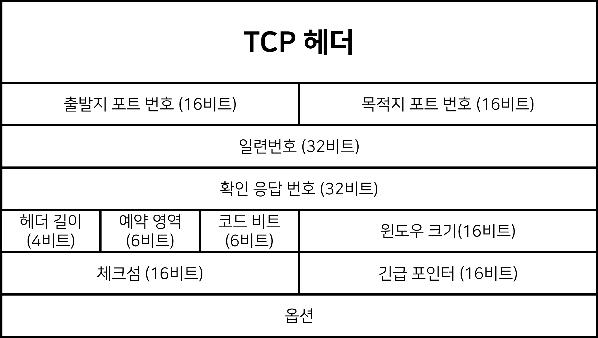
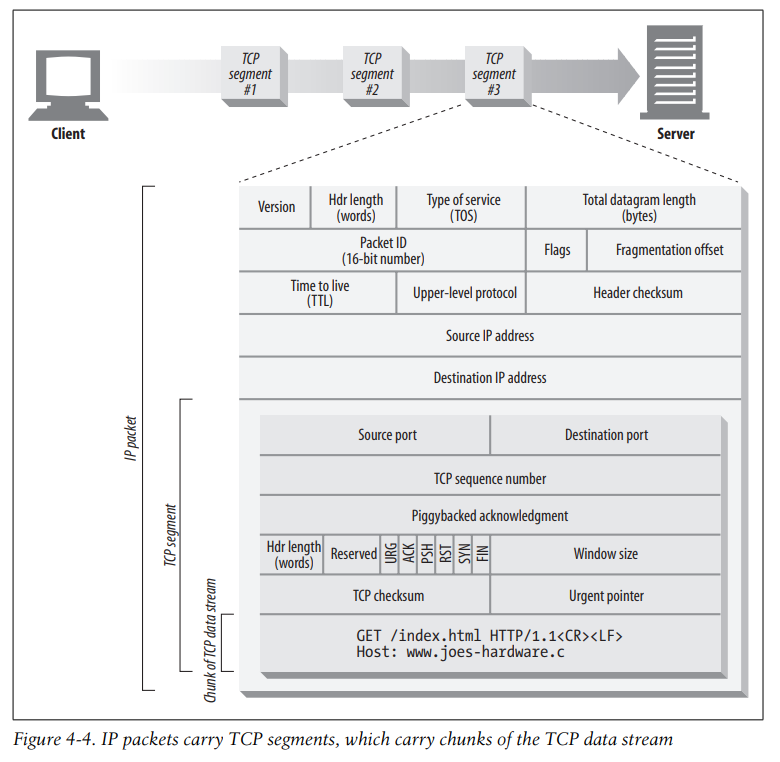

# 04. 커넥션 관리

> HTTP는 어떻게 TCP 커넥션을 사용하는가
>
> TCP 커넥션의 지연, 병목, 막힘
>
> 병렬 커넥션, keep-alive 커넥션, 커넥션 파이프라인을 활용한 HTTP의 최적화
>
>  커넥션 관리를 위해 따라야 할 규칙들

## 4.0 시작하기 전에..

> 책을 읽다보니 TCP에 대해 모르는 것들이 너무 많아 "모두의 네트워크" 책을 통해 TCP에 대해 정리를 하고 시작하고자 한다.

### 4.0.1 전송계층 (Transport Layer)

OSI 모델 전송 계층 (Transport)은 목적지에 신뢰할 수 있는 데이터를 전달하기 위해 필요

**기능**

- 오류가 발생하면 데이터를 재전송하도록 요청
- 전송된 데이터의 목적지가 어떤 애플리케이션인지 식별하는 기능

**연결형 통신 VS 비연결형 통신**

- 연결형 통신 : 신뢰성/정확성이 우선인 통신. TCP(Transmission Control Protocol) 사용
- 비연결형 통신 : 효율성이 우선인 통신. UDP(User Datagram Protocol) 사용


### 4.0.2 TCP

#### TCP 헤더

TCP로 전송할 때 붙이는 헤더



#### 세그먼트(segment)

TCP 헤더가 붙은 데이터

#### 연결 (connection, 커넥션)

- 연결형 통신은 꼼꼼하게 상대방을 확인하면서 데이터를 전송
- 데이터를 전송하기 전에 해야하는 작업을 커넥션이라고 함
- 가상의 독점 통신로를 확보하는 것
- TCP 헤더의 "코드비트" : 6비트로 연결의 제어 정보 기록. (URG / ACK / PSH / RST / SYN / FIN)
- 코드비트의 각 비트별로 역할 존재 + 초깃값 = 0. 비트 활성화되면 1
- 연결을 확립하려면 SYN(연결 요청), ACK(확인 응답)이 필요

### 4.0.3 3way 핸드셰이크

연결은 SYN과 ACK를 사용하여 확립하고, 신뢰할 수 있는 연결을 하려면 데이터 전송 전에 패킷을 교환하는데 다음 처럼 3번 확인하게 된다.

```sequence
컴퓨터1->컴퓨터2: ① 연결 확립 요청 [SYN]
컴퓨터2->컴퓨터1: ② 연결 확립 응답 + 연결 확립 요청 [SYN] [ACK]
컴퓨터1->컴퓨터2: ③ 연결 확립 응답 [ACK]
```

① 통신을 하려면 컴퓨터2에게 허가를 받아야 하므로, 연결 확립 허가를 받기 위한 요청(SYN)을 보낸다.

② 컴퓨터2는 요청을 받은 후 허가한다는 응답을 회신하기 위해 연결 확립 응답(ACK)를 보낸다. 동시에 컴퓨터2도 컴퓨터1에게 데이터 전송 허가를 받기 위해 연결 확립 요청 (SYN) 을 보낸다.

③ 컴퓨터2의 요청을 받은 컴퓨터1은 컴퓨터2로 허가한다는 응답으로 연결 확립 응답(ACK)을 보낸다.


데이터를 전송한 후에는 연결을 끊기 위한 요청을 교환해야 한다.

연결을 끊을 때는 FIN 과 ACK를 사용하는데 FIN은 연결 종료를 뜻한다.

```sequence
컴퓨터1->컴퓨터2: ① 연결 종료 요청 [FIN]
컴퓨터2->컴퓨터1: ② 연결 종료 응답 [ACK] + 연결 종료 요청 [FIN] 
컴퓨터1->컴퓨터2: ③ 연결 확립 응답 [ACK]
```

### 4.0.4 일련번호와 확인 응답 번호의 구조

> 3-way 핸드셰이크 이후 데이터 전송에 사용되는 TCP 헤더의 일련번호와 확인 응답 번호

#### 일련번호 (sequence number)

송신 측에서 수신 측에 이 데이터가 몇 번째 데이터인지 알려주는 역할

#### 확인 응답 번호 (acknowledgement number)

수신 측이 몇 번째 데이터를 수신했는지 송신 측에 알려주는 역할

#### 재전송 제어

데이터가 항상 올바르게 전달되는 것은 아니므로 **일련번호**와 **확인 응답 번호**를 사용해서 데이터가 손상되거나 유실된 경우에 데이터를 재전송하게 하는 것

#### 윈도우 크기

앞서까지는 세그먼트(데이터) 하나를 보낼 때마다 확인 응답을 한 번 반환하는 통신

위와 같은 통신은 한 번 보낼 때 마다 한 번 응답을 반환하는 형식이어서 효율이 높지 않다.

효율을 높이기 위해 세그먼트를 연속으로 보내고 난 다음에 확인 응답을 반환한다.

이 때 연속으로 보낸 세그먼트를 일시적으로 보관하는 장소를 버퍼 (buffer) 라고 한다.

하지만 수신 측이 세그먼트를 대량으로 받아 보관하지 못하고 넘쳐버릴 수 있고 이를 오버플로 (overflow)라고 한다.

이 오버플로가 발생하지 않도록 버퍼의 한계 크기(얼마나 많은 용량의 데이터를 저장해 둘 수 있나)를 알고 있어야 하고, 그것이 TCP 헤더의 윈도우 크기 값에 해당

이 윈도우 크기의 초기값은 3-way 핸드셰이크를 할 때 판단한다. 

### 4.0.5 포트 번호의 구조

#### 포트 번호 (port number)

전송계층은 전송된 데이터의 목적지가 어떤 애플리케이션인지 구분하는 역할이 있다.

포트 번호로 이 애플리케이션을 구분할 수 있게 된다. (0~65535번)

**well-known ports** : 0~1023번. 주요 프로토콜이 사용하도록 예약.

**랜덤 포트** : 1025번 이상. 클라이언트 측의 송신 포트로 사용


## 4.1 TCP 커넥션

모든 HTTP 통신은 TCP/IP를 통해 이루어진다.


##### URL을 입력 받은 브라우저가 수행하는 단계

`http://www.joes-hardware.com:80/power-tools.html`

(1) 브라우저가 `www.joes-hardware.com`라는 호스트 명을 추출한다.

(2) 브라우저가 이 호스트 명에 대한 IP 주소를 찾는다. (`202.43.78.3`)

(3) 브라우저가 포트번호(`80`)을 얻는다.

(4) 브라우저가 `202.43.78.3`의 `80`포트로 TCP 커넥션을 생성한다.

(5) 브라우저가 서버로 HTTP GET 요청 메시지를 보낸다.

(6) 브라우저가 서버에서 온 HTTP 응답 메시지를 읽는다.

(7) 브라우저 커넥션을 끊는다.


#### 4.1.1 신뢰할 수 있는 데이터 전송 통로인 TCP

HTTP 커넥션은 몇몇 사용 규칙을 제외하고는 TCP 커넥션에 불과하다.

TCP 커넥션은 인터넷을 안정적으로 연결해준다.

TCP는 HTTP에게 신뢰할 만한 통신 방식을 제공.

TCP 커넥션의 한쪽에 있는 바이트들은 반대쪽으로 순서에 맞게 정확히 전달된다.


#### 4.1.2 TCP 스트림은 세그먼트로 나뉘어 IP 패킷을 통해 전송된다.

세그먼트 : 전송계층에서 TCP 헤더를 붙인 데이터 (TCP의 단위)

이를 IP 패킷으로 감싸 전달



#### 4.1.3 TCP 커넥션 유지하기

컴퓨터는 항상 TCP 커넥션을 여러 개 가지고 있다. TCP는 포트 번호를 통해 이런 여러 개의 커넥션을 유지한다.

TCP 커넥션은 4가지 값으로 식별하며 서로 다른 두개의 TCP는 아래 4가지 구성요소 값이 전부 다 같을 수 없다.

`발신지 IP 주소, 발신 포트, 수신지 IP 주소, 수신 포트`

#### 4.1.4 TCP 소켓 프로그래밍

운영체제는 TCP 커넥션의 생성과 관련된 여러 기능을 제공한다.

| 소켓 API 호출                 | 설명                                                       |
| ----------------------------- | ---------------------------------------------------------- |
| `s = socket(<parameters>)`    | 연결이 되지 않은 익명의 새로운 소켓 생성                   |
| `bind(s, <local IP:port>)`    | 소켓에 로컬 포트 번호와 인터페이스 할당                    |
| `connect(s, remote IP:port>)` | 로컬의 소켓과 원격의 호스트 및 포트 사이에 TCP 커넥션 생성 |
| `listen(s, ...)`              | 커넥션을 받아들이기 위해 로컬 소켓에 허용함을 표시         |
| `s2 = accept(s)`              | 누군가 로컬 포트에 커넥션을 맺기를 기다림                  |
| `n = read(s, buffer, n)`      | 소켓으로부터 버퍼에 n 바이트 읽기 시도                     |
| `n = write(s, buffer, n)`     | 소켓으로부터 버퍼에 n 바이트 쓰기 시도                     |
| `close(s)`                    | TCP 커넥션을 완전히 끊음                                   |
| `shutdown(s, <side>)`         | TCP 커넥션의 입출력만 닫음                                 |
| `getsockopt(s, ...)`          | 내부 소켓 설정 옵션값을 읽음                               |
| `getsockopt(s, ...)`          | 내부 소켓 설정 옵션값을 변경                               |

`[표] 소켓 API의 주요 인터페이스`

이 소켓 API는 HTTP 프로그래머에게 TCP 와 IP의 세부사항들을 숨긴다.

소켓 API를 사용하면 TCP 종단 (endpoint) 데이터 구조를 생성하고, 원격 서버의 TCP 종단에 그 종단 데이터 구조를 연결하여 데이터 스트림을 읽고 쓸 수 있다.

TCP API는 기본적인 네트워크 프로토콜의 핸드셰이킹, 그리고 TCP 데이터 스트림과 IP 패킷 간의 분할 및 재조립에 대한 모든 세부사항을 외부로부터 숨긴다.


## 4.2 TCP의 성능에 대한 고려

HTTP는 TCP 바로 위에 있는 계층이기 때문에 HTTP 트랜잭션의 성능은 그 아래 계층인 TCP 성능에 영향을 받는다.

이 절에서는 TCP 커넥션의 성능에 관련된 주요 고려사항을 집중적으로 다룬다.

#### 4.2.1 HTTP 트랜잭션 지연


트랜잭션을 처리(Process)하는 시간은 TCP 커넥션을 설정(Connect)하고, 요청을 전송(Request)하고, 응답 메시지를 보내는 것(Response)에 비하면 상당히 짧다.

따라서 너무 많은 데이터를 내려받거나 복잡하고 동적인 자원들을 실행하지 않는 한, 대부분의 HTTP지연은 TCP 네트워크 지연 때문에 발생한다.

**HTTP 트랜잭션을 지연시키는 원인**

1. DNS 이름 분석 인프라를 사용하여  URI의 호스트명을 IP 주소로 변환하는데 시간이 걸림.
   - 인프라의 발전으로 대부분 1초 미만으로 끝남.
2. TCP 커넥션 요청을 보내고 응답을 회신하기를 기다림.
3. 커넥션 맺은 후 클라는 HTTP 요청을 TCP 파이프를 통해 전송.
4. 웹 서버가 HTTP 응답 보낼 때

#### 4.2.2 성능 관련 중요 요소

HTTP 프로그래머에게 영향을 주는 가장 일반적인 TCP 관련 지연.

- TCP 커넥션의 핸드셰이크 설정
- 인터넷의 혼잡을 제어하기 위한 TCP의 느린 시작 (slow-start)
- 데이터를 한데 모아 한 번에 전송하기 위한 네이글(nagle) 알고리즘
- TCP의 편승(piggyback) 확인응답(acknowledgment)을 위한 확인응답 지연 알고리즘
- TIME_WAIT 지연과 포트 고갈

#### 4.2.3 TCP 커넥션 핸드셰이크 지연

**TCP 커넥션이 핸드셰이크를 하는 순서** : 4.0.3 참조

HTTP 프로그래머는 이 패킷들을 보지 못한다. HTTP 프로그래머가 보는 것은 새로운 TCP 커넥션이 생성될 때 발생하는 지연이 전부.

HTTP 트랜잭션이 아주 큰 데이터를 주고받지 않는 평범한 경우 SYN/SYN+ACK 핸드셰이크가 눈에 띄는 지연을 발생시킨다. TCP의 ACK 패킷은 HTTP 요청 메세지 전체를 전달할 수 있을만큼 큰 경우가 많고, 많은 HTTP 서버 응답 메시지는 하나의 IP 패킷에도 담길 수 있다.

결국 크기가 작은 HTTP 트랜잭션은 50% 이상의 시간을 TCP를 구성하는데 쓴다.

#### 4.2.4 확인응답 지연

인터넷이 패킷 전송을 완벽하게 보장하지는 않으므로 TCP는 성공적인 데이터 전송을 보장하기 위해 자체적인 확인 체계를 가진다.

각 세그먼트의 수신자는 세그먼트를 받으면 작은 확인응답 패킷을 송신자에게 보내고, 특정 시간 안에 확인응답 메시지를 받지 못하면 패킷이 파기되었거나 오류가 있는 것으로 판단하고 데이터를 다시 전송한다.

확인응답은 크기가 작기 때문에, TCP 는 네트워크를 좀 더 효율적으로 사용하기 위해 같은 방향으로 송출되는 데이터 패킷에 확인응답을 편승시킨다. **확인응답 지연**은 송출할 확인응답을 특정 시간 동안 버퍼에 저장해 두고, 확인응답을 편승시키기 위해 송출 데이터 패킷을 찾아서 전송하는데 일정 시간에 찾지 못하면 별도 패킷을 만들어서 전송한다.

#### 4.2.5 TCP 느린 시작(slow start)

처음에는 커넥션의 최대 속도를 제한하고 데이터가 성공적으로 전송됨에 따라서 속도 제한을 높여나가는 것

인터넷의 급작스러운 부하와 혼잡을 방지

**TCP 느린 시작**은 TCP 가 한번에 전송할 수 있는 패킷의 수를 제한.  패킷이 성공적으로 전달되는 시점에 송신자는 추가로 2개의 패킷을 더 전송할 수 있는 권한을 얻는다. 확인응답을 받으면 2개의 패킷을 보낼 수 있고, 패킷 각각 해당되는 확인응답을 받으면 총 4개의 패킷을 보낼 수 있는 것을 **혼잡제어 기능**이라 한다.

이 혼잡제어 기능 때문에, 새로운 커넥션은 이미 어느 정도 데이터를 주고 받은 "튜닝"된 커넥션보다 느리다. 따라서 HTTP에는 이미 존재하는 커넥션을 재사용하는 기능이 있다.

#### 4.2.6 네이글(Nagle) 알고리즘과 TCP_NODELAY

네이글 알고리즘 : 네트워크 효율을 위해서 패킷을 전송하기 전에 많은 양의 TCP 데이터를 한개의 덩어리로 합치는 알고리즘

네이글 알고리즘은 세그먼트가 최대크기가 되지 않으면 전송하지 않지만, 모든 패킷이 확인응답을 받았을 경우에는 최대 크기보다 작은 패킷의 전송을 허락한다. 다른 패킷들이 아직 전송 중이면 데이터는 버퍼에 저장된다.

네이글 알고리즘은 성능에 관련해 여러 문제를 발생시키는데 

1. 크기가 작은 HTTP 메시지는 패킷을 채우지 못하기 때문에 앞으로 생길지 안생길지 모르는 추가 데이터를 기다리며 지연
2. 확인응답 지연과 함께 쓰일 경우 형편없이 동작. 네이글 알고리즘은 확인응답이 도착할 때 까지 데이터 전송을 멈추고 있는 반면, 확인응답 지연 알고리즘은 확인응답을 100~200밀리초 지연.

#### 4.2.7 TIME WAIT의 누적과 포트 고갈

pass


## 4.3 HTTP 커넥션 관리

커넥션을 생성하고 최적화하는 HTTP 기술

HTTP 커넥션 헤더

HTTP 커넥션의 최적화 기술

#### 4.3.1 흔히 잘못 이해하는 Connection 헤더


#### 4.3.2 순차적인 트랜잭션 처리에 의한 지연


## 4.4 병렬(parallel) 커넥션

여러 개의 TCP 커넥션을 통한 동시 HTTP 요청


## 4.5 지속(persistent) 커넥션

커넥션을 맺고 끊는데서 발생하는 지연을 제거하기 위한 TCP 커넥션의 재활용


## 4.6 파이프라인(pipelined) 커넥션

공유 TCP 커넥션을 통한 병렬 HTTP 요청


## 4.7 커넥션 끊기에 대한 미스터리


## 4.8 추가 정보


